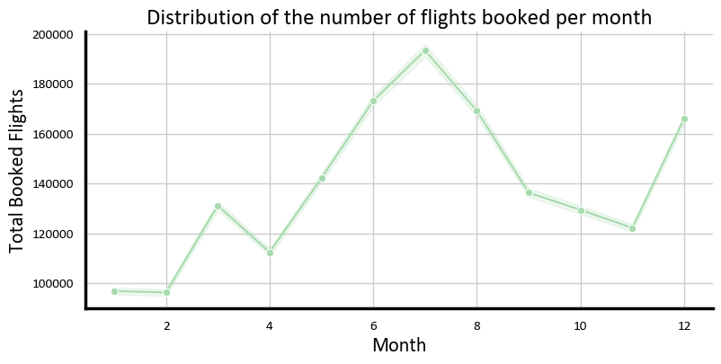
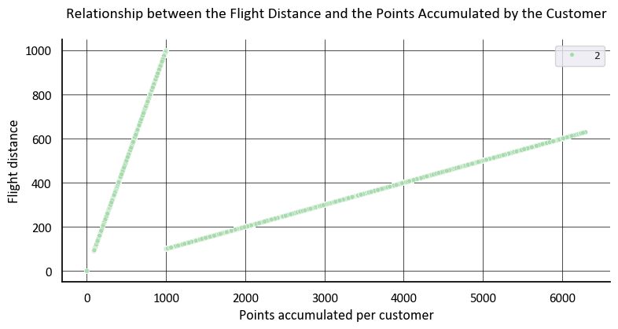
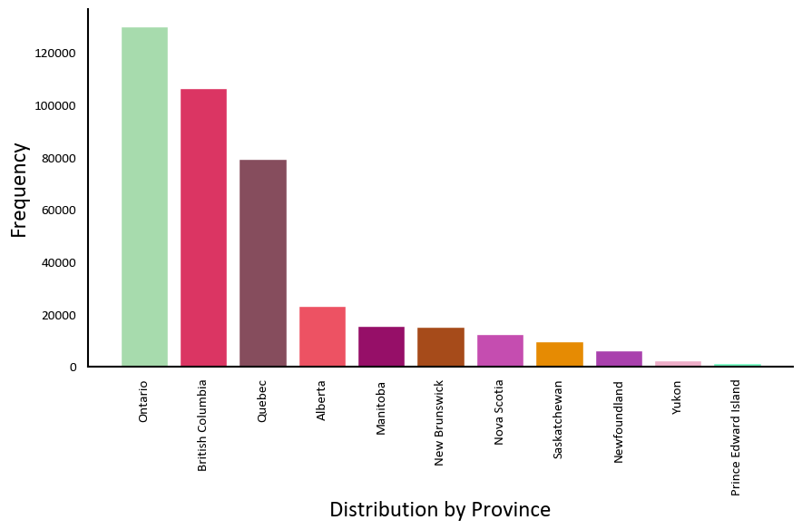
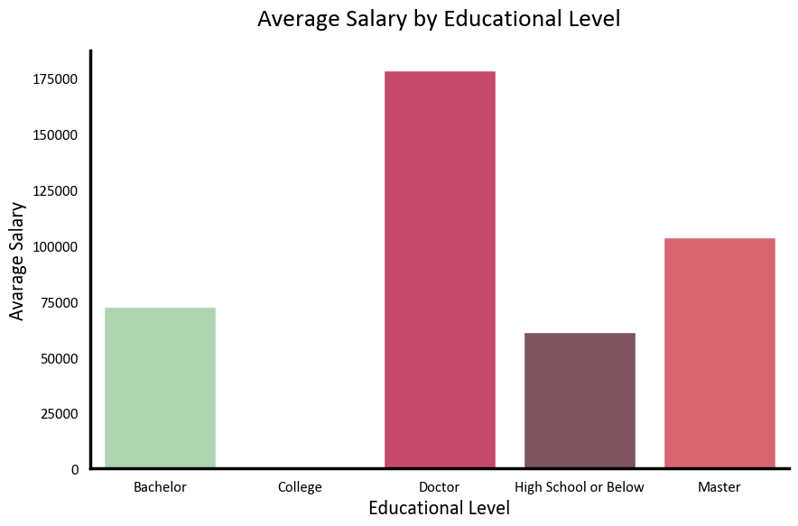
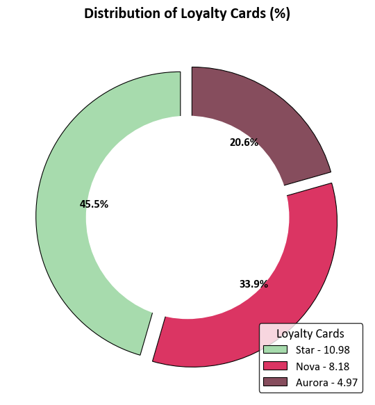
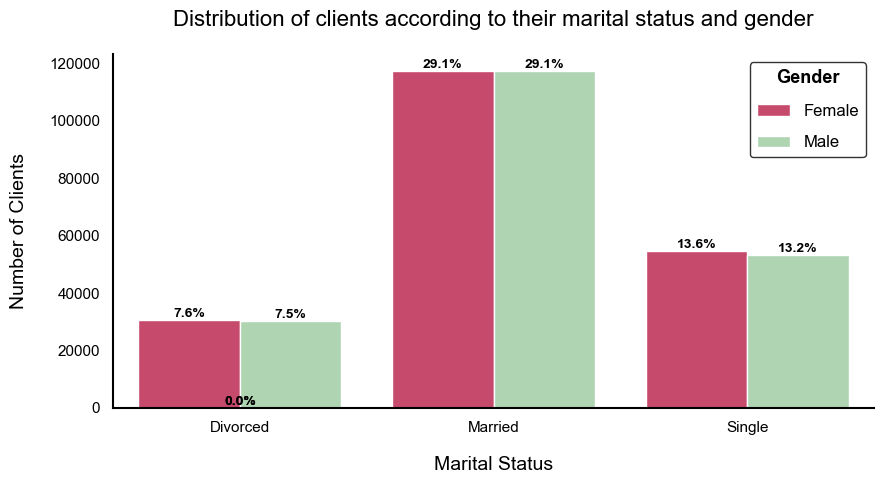
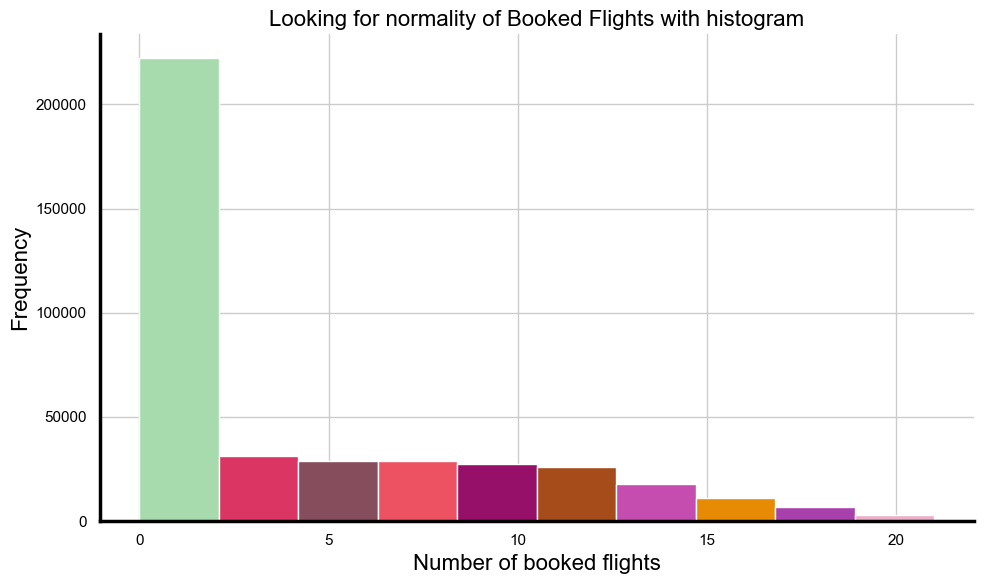

# **Análisis de Datos de Vuelos y Clientes ✈️**

En este proyecto, se ha trabajado con dos conjuntos de archivos que, en conjunto, describen el comportamiento de los clientes dentro de un programa de lealtad de una aerolínea. A través de un proceso estructurado, se ha realizado una exploración inicial, limpieza de datos y análisis estadístico.
#
### **Librerías Utilizadas 📚**

* **Matplotlib:** Para la visualización de datos.  
* **Seaborn:** Para la creación de gráficos estadísticos.  
* **Pandas:** Para la manipulación y análisis de datos.
#
________________________________________________________
#
## **Exploración y Limpieza de Datos 🔍**

Se llevó a cabo un Análisis Exploratorio de Datos (*EDA*), donde se realizaron las siguientes acciones:

* **Renombrado de Columnas**: Se han cambiado los nombres de las columnas para mayor claridad.  
* **Tipos de Datos**: Se corrigieron los tipos de datos de las columnas para asegurar la correcta manipulación.  
* **Rectificación de Datos**: Se han rectificado los datos en columnas específicas para asegurar su integridad.  
* **Eliminación de Duplicados**: Se eliminaron los registros duplicados para evitar sesgos en el análisis.  
* **Manejo de Nulos y Ceros**: No se rellenaron los nulos o ceros, puesto que tras diversas pruebas se reveló que no hay una relación fuerte entre las variables, así como valores atípicos. Por ende se concluye que los ceros se consideran significativos, revelando información valiosa sobre los datos.

* **Unión de *DataFrames***
Se realizó una unión de ambos archivos (*DataFrames*) para tener una base de datos consolidada y más rica en información.
#
## **Métodos Gráficos 📊**

Se implementaron métodos gráficos para responder a diversas preguntas clave:

1. #### **¿Cómo se distribuye la cantidad de vuelos reservados por mes durante el año?**

   * Se decanta por el método gráfico *lineplot,* ya que es una buena opción porque permite ver de forma clara cómo varían las reservas de vuelos mes a mes, mostrando tendencias fácilmente.  
   * **Lectura:**  
     *  Se observa en el gráfico que las personas viajan levemente en marzo y comienzan la temporada de viajes en mayo, alcanzando su pico en julio, que desciende en octubre, pero que vuelve a subir en diciembre.  
       * Clasificando por picos sería:  
         * muy bajo (100000): enero y febrero  
         * bajo (118000-120000): abril y noviembre  
         * medio (135000-140000): marzo, mayo, septiembre, octubre  
         * alto (161000-178000): junio, agosto y diciembre  
         * muy alto (198000): julio  
     * Con esto podemos decir que el pico se encuentra en julio y el punto más bajo en enero. También se observa que las festividades y el clima juegan un factor importante en la toma de decisión de los clientes al volar.  
   * **Aportación:**  
     * Como sugerencia la empresa podría realizar campañas de marketing teniendo en cuenta las festividades fomentando los viajes ya de por sí altos y haciendo campañas y bajando los precios para las temporadas bajas teniendo en cuenta los destinos con un clima cálido que es el contraste observado en el gráfico.  
        ####
         
       

#### 

2. #### **¿Existe una relación entre la distancia de los vuelos y los puntos acumulados por los clientes?**

   * Se decanta por el método de gráfico *scatterplot,* ya que contamos con dos variables numéricas y queremos conocer la relación entre ambas, por lo que el método nos puede ayudar a visualizarlo.  
   *  **Lectura:**  
     * Se observa en el *DataFrame* que hay una relación directa y lineal, puesto que los puntos equivalen a los tres primeros dígitos de la distancia recorrida.  
     * En el gráfico observamos la relación lineal de cada una de las variables.
       
        

   #### 

3. #### **¿Cuál es la distribución de los clientes por provincia o estado?**

   * Se decanta por un método de gráfico de barras, ya que estamos trabajando con una única variable categórica. El método agrupa los resultados por barras facilitando su lectura.  
   * **Lectura:**  
     * Se observa que de la base de datos entregados y examinando los registros, está más implantada en las provincias de Ontario, la Columbia Británica y Quebec, esto puede tener sentido, ya que son las provincias con los PIB más altos de Canadá. El PIB más alto de Canadá lo tiene la Columbia Británica, seguido de Ontario con el 5.º puesto y Quebec con el 6.º. También Ontario es la provincia con mayor población del país y cuenta con un centro industrial y comercial importante.  
   * **Aportación:**  
     * Se le sugiere a la empresa un estudio de mercado comparando con otras compañías aéreas del mismo nivel y adaptar una estrategia de marketing adecuada para llegar a implantarse de manera más robusta en las provincias o ciudades en donde lo vea necesario.

        
       
     ####     

4. #### **¿Cómo se compara el salario promedio entre los diferentes niveles educativos de los clientes?**

   * Se decanta por el método gráfico *BarPlot*, ya que muestra las comparaciones entre categorías. También es un método que nos permite combinar variables categóricas y numéricas.  
   * **Lectura:**  
     * Se observa que a mayor grado educativo mayor es el salario.  
     * Se puede intuir que los clientes con únicamente bachillerato serán los salarios más bajos del gráfico, si bien es verdad que no se cuenta con la información del salario de las personas con bachillerato

        
       
      ####    

5. #### **¿Cuál es la proporción de clientes con diferentes tipos de tarjetas de fidelidad?**

   * Se decanta por el método gráfico *pieplot*, ya que muestra las proporciones de un total y funciona con variables categóricas.  
   *  **Lectura:**  
     * Se observa que hay una clara tendencia con casi la mitad a la tarjeta *“Star”*, seguido de la tarjeta *“Nova”* con un poco más del 30 porciento y por último la tarjeta *“Aurora”*. Se observa que hay una inclinación clara por la tarjeta *“Star”.*  
   *  **Aportación:**  
     * Se sugiere que la empresa revise sus estrategias pasadas para poder conocer los motivos por parte de los clientes por esta fuerte tendencia. Seguido, se propone que el equipo de marketing, entre otros, revisen cuál es el equilibrio óptimo de tipos de tarjetas para la empresa y crear una campaña para adecuarlo acorde a lo que desea obtener.

        
       
  #### 
  
6. #### **¿Cómo se distribuyen los clientes según su estado civil y género?**

   * Se decanta por el método gráfico *Barplot*, ya que muestra la comparación entre categorías. También permite la comparación entre variables categóricas.  
   * **Lectura:**  
     * Es proporcional. El gráfico nos muestra que no hay diferencias significativas de género para los 3 estados civiles (casado, soltero, divorciado). La proporción de divorciados es casi la mitad de solteros, mientras que la de casados es casi el doble que la de solteros. Esto índica que hay una tendencia al matrimonio entre la población de los registros estudiados.

       

    #### 

## **Análisis A/B Testing ⚖️**

En la fase final, se llevó a cabo un A/B Testing buscando evaluar si existen diferencias significativas en el número de vuelos reservados según el nivel educativo de los clientes.

1. #### **Análisis Descriptivo sobre las estadísticas principales:** 

   * **Conteo:** Se registran las repeticiones por nivel educativo. La mayoría tiene licenciatura, seguida por universitarios/técnicos, mientras que el doctorado es el menos común.  
   * **Media:**  La media, que es de 4, es bastante similar entre los diferentes niveles educativos.  
   * **Mediana:** La mediana es 1, lo que limita su utilidad en este análisis.  
   * **Varianza:** Con una varianza de 27, se observa una gran dispersión en los datos, indicando la existencia de valores atípicos.  
   * **Desviación estándar:** La desviación estándar es de 5, superando la media, lo que sugiere inconsistencia en los datos y una cantidad significativa de valores atípicos.  
   * **Rango:** El rango total es de 21, lo que también sugiere la presencia de valores atípicos en el conjunto de datos.  
   * **Percentiles:** La mayoría se encuentra en el percentil 3 (más del 75%), lo que indica que pocos clientes reservan en promedio 8, reafirmando la presencia de valores atípicos.

   

2. #### **Prueba Estadística:** 

Se realizó una prueba A/B Testing para determinar si existía una diferencia significativa en el número de vuelos reservados entre los diferentes niveles educativos.

* **Hipótesis:**  
  * **H0**: No existe diferencia significativa en el número de vuelos reservados entre los niveles educativos.  
  * **H1**: Existe una diferencia significativa en el número de vuelos reservados entre los niveles educativos.

* **Eligiendo el método de prueba:**  
  * Se optó por pruebas no paramétricas tras comprobar la normalidad con un histograma, el cual mostró un fuerte sesgo positivo, dado que la mayoría no reserva vuelos. Se descartó la prueba Kruskal-Wallis, adecuada para este caso, ya que solo se aplica a datos numéricos y en nuestras categorías numéricas hay un alto porcentaje de ceros. Finalmente, se eligió la prueba Mann-Whitney U, que aunque compara solo dos grupos, permite trabajar con datos numéricos y categóricos, siendo válida debido a la falta de normalidad y la presencia de outliers.  
* **Resultados:**  
  * **Estadística U**: 286789.5  
    Este valor de la prueba Mann-Whitney U indica que no hay diferencias significativas en las distribuciones de los grupos comparados, ya que un valor alto de U no es suficiente para demostrar diferencias.  
  * **Valor p**: 0.9788  
    Este valor es mucho mayor que el umbral de 0.05, lo que indica que no hay evidencia suficiente para rechazar la hipótesis nula. Esto sugiere que no hay diferencias significativas en el número de vuelos reservados entre los grupos.  
  * **Conclusión**:  
    Dado que el valor p es tan alto, no se rechaza la hipótesis nula (H0). Esto sugiere que no existen diferencias significativas en el número de vuelos reservados entre los diferentes niveles educativos analizados. En otras palabras, los datos indican que la cantidad de vuelos reservados no varía de manera significativa entre los grupos, lo que puede implicar que el nivel educativo no influye en el comportamiento de reserva de vuelos de los clientes. Este resultado tiene implicaciones importantes, ya que sugiere que las estrategias de marketing o las políticas de precios podrían no necesitar ser ajustadas en función del nivel educativo de los clientes.  

    

#### 
______________________________________
____________________________________
## **Conclusión** ✅

Este proyecto de análisis de datos de vuelos y clientes ha permitido comprender mejor el comportamiento de los usuarios en un programa de lealtad de una aerolínea. A través de un exhaustivo proceso de exploración y análisis estadístico, se han identificado patrones en la distribución de reservas, así como la relación entre la distancia de los vuelos y los puntos acumulados. Los resultados sugieren que las estrategias de marketing deben enfocarse en las tendencias estacionales y geográficas, así como en las preferencias por las tarjetas de fidelidad.

El análisis A/B Testing indica que no hay diferencias significativas en el número de vuelos reservados según el nivel educativo de los clientes, lo que sugiere que el perfil educativo no es un factor determinante en su comportamiento de reserva. Este hallazgo permite a la aerolínea redirigir sus esfuerzos de marketing hacia otros aspectos más relevantes, estableciendo así una base sólida para futuras estrategias comerciales.

_____________________________________
_________________________________
